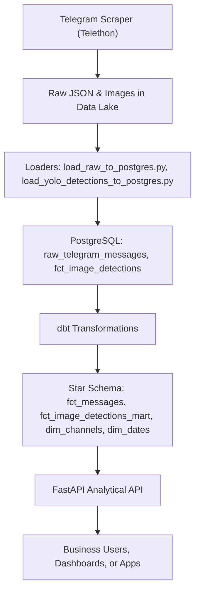

# Shipping a Data Product: From Raw Telegram Data to an Analytical API

## Project Status
- **Task 0:** Project setup & environment management ✅
- **Task 1:** Data scraping and collection ✅
- **Task 2:** Data modeling and transformation (dbt) ✅
- **Task 3:** Data enrichment with YOLO ✅
- **Task 4:** Analytical API ✅
- **Task 5:** Pipeline orchestration ⏳

## Project Overview
This project delivers a robust, end-to-end data platform for extracting, transforming, enriching, and serving insights from public Telegram channels about Ethiopian medical businesses. The pipeline is designed for reproducibility, scalability, and security, leveraging:
- **Telethon** for Telegram scraping
- **YOLOv8** for image enrichment
- **dbt** for data transformation and star schema modeling
- **FastAPI** for analytical API endpoints
- **Docker & Docker Compose** for environment management
- **Dagster** (Task 5) for orchestration (see next steps)

### Business Need & Goals
- Answer key business questions:
  - What are the most frequently mentioned medical products or drugs across all channels?
  - How does the price or availability of a specific product vary across channels?
  - Which channels have the most visual content (e.g., images of pills vs. creams)?
  - What are the daily and weekly trends in posting volume for health-related topics?
- Build a reproducible, secure, and scalable data product for analytics and reporting.

## Table of Contents
- [Project Structure](#project-structure)
- [Setup & Reproducibility](#setup--reproducibility)
- [Data Collection Mechanism](#data-collection-mechanism)
- [Data Modeling & Transformation](#data-modeling--transformation)
- [Machine Learning Integration (YOLO)](#machine-learning-integration-yolo)
- [Analytical API (FastAPI)](#analytical-api-fastapi)
- [Testing & Validation](#testing--validation)
- [Security & Best Practices](#security--best-practices)
- [Screenshots](#screenshots)
- [Pipeline & Star Schema Diagrams](#pipeline--star-schema-diagrams)
- [Reflection & Key Takeaways](#reflection--key-takeaways)
- [Final Submission Checklist](#final-submission-checklist)
- [References](#references)
- [Contributing, Authors, License](#contributing-authors-license)

## Project Structure
```
├── data/                # Raw and processed data (gitignored)
├── notebooks/           # Jupyter/Colab notebooks for scraping, EDA, etc.
├── src/                 # Source code for pipeline, loaders, API
├── telegram_dbt/        # dbt project (models, tests, docs)
├── requirements.txt     # Python dependencies
├── Dockerfile           # Containerization for reproducibility
├── docker-compose.yml   # Orchestrates app and PostgreSQL
├── .env.example         # Environment variable template
├── .gitignore           # Excludes secrets, venv, data, and instructions
├── screenshots/         # API and pipeline screenshots for report
├── README.md            # Project documentation
```

## Setup & Reproducibility
1. **Clone the repository**
2. **Create and activate a virtual environment**
3. **Install dependencies**
   ```sh
   pip install -r requirements.txt
   ```
4. **Configure environment variables**
   - Copy `.env.example` to `.env` and fill in your secrets (never commit `.env`)
5. **Start the stack with Docker Compose**
   ```sh
   docker-compose up --build
   ```
6. **Load raw data and run dbt models** (see below)

## Data Collection Mechanism (Task 1)
- **Telegram Scraper:**
  - Uses Telethon with robust error handling, logging, and retry logic.
  - Logs scraped channels and dates.
  - Organizes raw JSON and images in a partitioned structure:
    `data/raw/telegram_messages/YYYY-MM-DD/channel_name.json`
  - Automated retry mechanisms for rate limits and errors.
- **Logging:** All scraping actions and errors are logged for traceability.

## Data Modeling & Transformation (Task 2)
- **Loader Scripts:**
  - `src/load_raw_to_postgres.py` loads raw JSON into `raw_telegram_messages` in Postgres.
- **dbt Project:**
  - **Staging models:** Clean and restructure raw data.
  - **Mart models:** Star schema with `fct_messages`, `dim_channels`, `dim_dates`, etc.
  - **Tests:** Built-in (unique, not_null) and custom SQL tests for business rules.
  - **Docs:** dbt docs generated for all models.

## Machine Learning Integration (YOLO) (Task 3)
- **YOLOv8 Enrichment:**
  - `src/yolo_enrichment.py` processes images, runs YOLOv8, and saves detections.
  - `src/load_yolo_detections_to_postgres.py` loads detections into `fct_image_detections`.
- **dbt Integration:**
  - `fct_image_detections_mart` exposes enriched data for analytics.

## Analytical API (FastAPI) (Task 4)
- **Endpoints:**
  - `GET /api/reports/top-channels?limit=10`: Most active channels
  - `GET /api/channels/{channel_name}/activity`: Channel posting activity
  - `GET /api/search/messages?query=keyword`: Search messages
- **Pydantic Schemas:** All responses are validated and documented with field descriptions and examples.
- **Error Handling:**
  - 404 for missing channels, 422 for invalid queries, clear error messages.
- **CORS:** Enabled for frontend integration.
- **OpenAPI Docs:** Visit [http://localhost:8000/docs](http://localhost:8000/docs)

### API Usage Examples
#### curl
```sh
curl "http://localhost:8000/api/reports/top-channels?limit=5"
curl "http://localhost:8000/api/channels/lobelia4cosmetics/activity"
curl "http://localhost:8000/api/search/messages?query=paracetamol"
```
#### Python
```python
import requests
resp = requests.get("http://localhost:8000/api/reports/top-channels?limit=5")
print(resp.json())
```

## Testing & Validation
- **Automated API tests:** `tests/test_api.py` (pytest + httpx)
- **dbt tests:** Built-in and custom SQL tests
- **Manual validation:** Swagger UI, curl, Postman

## Security & Best Practices
- **Secrets:** All secrets in `.env` (gitignored); `.env.example` provided
- **Dockerized:** Full stack runs with Docker Compose
- **Code Quality:** Modular, commented, and follows best practices
- **Repository Organization:** Clear separation of scraping, dbt, API, and orchestration

## Engineering Decisions & Justifications
- **Docker & Docker Compose:** Chosen for reproducibility, scalability, and consistent environments across development and production. This ensures anyone can run the project with a single command, regardless of OS or local setup.
- **Data Lake Partitioning:** Raw data is stored in a partitioned directory structure (`data/raw/telegram_messages/YYYY-MM-DD/channel_name.json`) for easy incremental processing, traceability, and efficient downstream loading.
- **Star Schema Design:** dbt models implement a star schema for analytical performance, reliability, and ease of querying. This structure supports business questions and scales well for reporting.
- **.env & Security:** All secrets and environment variables are managed in `.env`, which is excluded from version control. `.env.example` provides a template for safe configuration.

## Task-by-Task File Mapping
- **Task 0 (Setup):**
  - `requirements.txt`, `Dockerfile`, `docker-compose.yml`, `.env.example`, `.gitignore`
- **Task 1 (Scraping):**
  - `src/scraping.py` (or `scraping.ipynb`), `data/raw/telegram_messages/`
- **Task 2 (Transformation):**
  - `src/load_raw_to_postgres.py`, `telegram_dbt/` (dbt project, models, tests)
- **Task 3 (Enrichment):**
  - `src/yolo_enrichment.py`, `src/load_yolo_detections_to_postgres.py`, `telegram_dbt/models/example/fct_image_detections_mart.sql`
- **Task 4 (API):**
  - `src/api.py`, `src/crud.py`, `src/schemas.py`, `src/database.py`
- **Task 5 (Orchestration):**
  - `orchestration/pipeline.py`, `orchestration/repository.py`, `orchestration/pyproject.toml`

## Logging & Error Handling
- **Scraping:**
  - All scraping actions, errors, and outcomes are logged in real time. Automated retry logic ensures resilience to network/API errors and rate limits.
- **Pipeline:**
  - Each Dagster op checks subprocess return codes and raises clear exceptions. Logs are available in the Dagster UI for every run and step.
- **API:**
  - FastAPI endpoints return clear error messages (404, 422) for missing data or invalid queries.

## dbt Custom Tests & Documentation
- **Built-in Tests:** All primary keys and critical columns are validated with `unique` and `not_null` tests.
- **Custom Tests:** At least one custom SQL test is included to enforce a key business rule (see `telegram_dbt/tests/`).
- **Documentation:** dbt docs are generated for all models, and schema.yml files include detailed descriptions.

## Security & Environment Management
- **.env:** All secrets (DB credentials, API keys) are stored in `.env`, which is gitignored.
- **.env.example:** Provides a safe template for configuration.
- **No secrets are ever committed.**

## Pipeline Extensibility
- **Modular Design:** Each pipeline stage is a separate script/module and Dagster op.
- **Easy to Extend:** Add new ops (e.g., data validation, notifications), sensors, or schedules in `orchestration/pipeline.py`.
- **Configurable:** Use Dagster config to parameterize ops for different environments or data sources.

## Screenshots
- The following screenshots demonstrate the working API endpoints and pipeline runs. See the `screenshots/` folder for full-resolution images:
  - `screenshots/api_swagger_ui.png`: Swagger UI showing all endpoints
  - `screenshots/api_top_channels.png`: Example response for /api/reports/top-channels
  - `screenshots/api_channel_activity.png`: Example response for /api/channels/{channel_name}/activity
  - `screenshots/api_search_messages.png`: Example response for /api/search/messages
  - `screenshots/pipeline_diagram.png`: Visual diagram of the full data pipeline
- Reviewers: Please open these images in the `screenshots/` folder for detailed views of the API and pipeline in action.

## Pipeline & Star Schema Diagrams
### Data Pipeline
- See `screenshots/pipeline_diagram.png` for the full visual diagram.
- For a quick reference, here is the pipeline in Mermaid format:


### Star Schema (Textual)
```
FCT_MESSAGES
  |-- channel_id --> DIM_CHANNELS
  |-- date_id    --> DIM_DATES
  |-- message_id <-- FCT_IMAGE_DETECTIONS_MART
```

## Pipeline Orchestration (Task 5)
- The full pipeline is orchestrated using Dagster in the `orchestration/` folder.
- **How to run the Dagster UI:**
  ```sh
  dagster dev orchestration/
  ```
  - This launches the Dagster web UI at http://localhost:3000 where you can monitor, trigger, and schedule pipeline runs.
- **Pipeline steps:**
  - Scrape Telegram data
  - Load raw data to Postgres
  - Run dbt transformations
  - Run YOLO enrichment and load detections
- **Scheduling:** The pipeline is scheduled to run daily at 2 AM.
- **Event-driven orchestration:**
  - A Dagster sensor automatically triggers the pipeline when new files are detected in `data/raw/telegram_messages`.
  - This enables near-real-time processing when new data arrives.
- **Best practices:**
  - All orchestration logic is separated from business logic for maintainability.
  - You can extend the pipeline by adding more ops, sensors, or schedules as needed.
- **Monitoring:** Use the Dagster UI to view logs, run history, and trigger manual runs.

## Reflection & Key Takeaways
- **Technical Choices:** Modular, reproducible stack (FastAPI, dbt, Docker, YOLO, Dagster)
- **Difficulties:** Schema alignment, dbt source/model debugging, end-to-end orchestration
- **Key Takeaways:** Reproducibility, modularity, and clear documentation are essential. ML integration adds new analytics. Automated tests and error handling are critical for reliability.


## References
- [FastAPI](https://fastapi.tiangolo.com/)
- [dbt](https://docs.getdbt.com/)
- [Ultralytics YOLOv8](https://docs.ultralytics.com/)
- [Dagster](https://dagster.io/)
- [Telethon](https://docs.telethon.dev/en/stable/)
- [Kimball Dimensional Modeling](https://www.kimballgroup.com/data-warehouse-business-intelligence-resources/kimball-techniques/dimensional-modeling-techniques/)

## Contributing, Authors, License
- **Contributions:** Welcome! Please fork the repo and submit a pull request.
- **Authors:** Tinbite Yonas
- **License:** [Specify license here] 